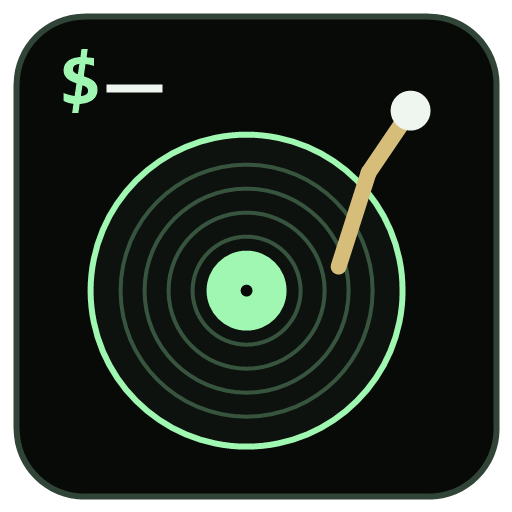

# 🎵 音乐播放器

基于 **Electron 28 + Vue 3 + TypeScript + Pinia** 的跨平台第三方音乐播放器，支持 **QQ音乐** 和 **网易云音乐** 双平台音源。

<p align="center">
  
</p>

## ✨ 功能特性

### 音乐播放
- 🎧 双平台音源切换（QQ音乐 / 网易云音乐）
- 🔍 歌曲搜索、在线播放、收藏管理
- 🎤 歌词同步显示（滚动歌词面板）
- 🎚️ 播放模式切换（顺序播放 / 随机播放 / 单曲循环）
- 📋 播放列表管理（创建、编辑、删除、拖拽排序、导入导出、搜索过滤）
- 📜 播放队列管理（查看和管理待播放列表）
- 🎤 歌手目录浏览
- ⭐ 收藏夹管理（独立于播放列表的收藏系统）

### 音频可视化
- 🌊 **AudioWaveform** — 实时音频波形可视化
- 🌀 **CoverPulseVisualizer** — 封面脉冲动效

### 桌面集成
- 📌 系统托盘控制（播放/暂停、上一曲、下一曲、显示/隐藏）
- 🌐 网络状态检测与离线提示
- 🎨 主题切换
- 💾 登录凭证持久化存储（electron-store 加密）

### 认证
- 📱 QQ音乐扫码登录
- 📱 网易云音乐扫码登录

## 🛠️ 技术栈

| 技术 | 说明 |
|------|------|
| Electron 28 | 跨平台桌面应用框架 |
| Vue 3 (Composition API) | 响应式前端框架 |
| TypeScript 5 | 类型安全 |
| Pinia | 状态管理 |
| Vite 5 | 构建与热更新 |
| SCSS | 模块化样式 |
| Vue Router 4 | 路由管理 |
| Axios | HTTP 客户端 |
| electron-store | 本地加密存储 |
| Vitest + fast-check | 单元测试 + 属性测试 |

## 📁 项目结构

```
music-player3/
├── electron/                       # Electron 主进程
│   ├── main.ts                     # 应用入口、窗口管理
│   ├── preload.ts                  # 预加载脚本（contextBridge）
│   ├── ipc-handler.ts              # 通用 IPC 通道处理
│   ├── netease-ipc-handler.ts      # 网易云 IPC 处理
│   ├── netease-credential-store.ts # 网易云凭证存储
│   ├── qq-music-ipc-handler.ts     # QQ音乐 IPC 处理
│   ├── qq-music-login-service.ts   # QQ音乐登录服务
│   ├── qq-music-credential-store.ts# QQ音乐凭证存储
│   ├── tray-manager.ts             # 系统托盘管理
│   └── tray-manager.test.ts        # 托盘管理测试
│
├── src/                            # Vue 渲染进程
│   ├── components/                 # UI 组件
│   │   ├── AudioWaveform.vue       # 音频波形可视化
│   │   ├── BlurBackground.vue      # 模糊背景
│   │   ├── CoverArt.vue            # 专辑封面
│   │   ├── CoverPulseVisualizer.vue# 封面脉冲动效
│   │   ├── LyricsPanel.vue         # 滚动歌词面板
│   │   ├── MusicSourceSelector.vue # 音源切换选择器
│   │   ├── NeteaseLoginDialog.vue  # 网易云登录弹窗
│   │   ├── NeteaseUserStatus.vue   # 网易云用户状态
│   │   ├── NetworkBanner.vue       # 网络状态横幅
│   │   ├── PlayerBar.vue           # 底部播放控制栏
│   │   ├── QQMusicLoginDialog.vue  # QQ音乐登录弹窗
│   │   ├── QQMusicUserStatus.vue   # QQ音乐用户状态
│   │   ├── SearchInput.vue         # 搜索输入框
│   │   ├── TrackItem.vue           # 歌曲列表项
│   │   └── TrackList.vue           # 歌曲列表
│   │
│   ├── views/                      # 页面视图
│   │   ├── PlayerView.vue          # 播放主界面
│   │   ├── SearchView.vue          # 搜索结果页
│   │   ├── PlaylistView.vue        # 播放列表页
│   │   ├── PlaylistDetailView.vue  # 播放列表详情
│   │   ├── QueueView.vue           # 播放队列页
│   │   ├── ArtistDirectoryView.vue # 歌手目录页
│   │   └── FavoritesView.vue       # 收藏夹页
│   │
│   ├── stores/                     # Pinia 状态管理
│   │   ├── player-store.ts         # 播放器核心状态
│   │   ├── playlist-store.ts       # 播放列表状态
│   │   ├── favorites-store.ts      # 收藏夹状态
│   │   ├── netease-login-store.ts  # 网易云登录状态
│   │   └── qq-music-login-store.ts # QQ音乐登录状态
│   │
│   ├── services/                   # 业务逻辑层
│   │   ├── audio-visualizer.ts     # 音频频谱分析服务
│   │   ├── playback-controller.ts  # 播放控制器
│   │   ├── playlist-manager.ts     # 播放列表管理
│   │   ├── favorites-manager.ts    # 收藏管理
│   │   ├── lyrics-service.ts       # 歌词服务
│   │   ├── search-service.ts       # 搜索服务
│   │   ├── music-api-adapter.ts    # 音源适配器
│   │   ├── netease-direct-adapter.ts   # 网易云直连适配器
│   │   ├── qq-music-direct-adapter.ts  # QQ音乐直连适配器
│   │   ├── qq-music-adapter.ts     # QQ音乐适配器
│   │   ├── playlist-import-service.ts  # 播放列表导入导出
│   │   └── ipc-renderer.ts         # 渲染进程 IPC 封装
│   │
│   ├── composables/                # 组合式 API
│   │   └── useAppInit.ts           # 应用初始化逻辑
│   │
│   ├── utils/                      # 工具函数
│   │   ├── artist-directory.ts     # 歌手目录数据整理
│   │   └── playlist-search.ts      # 播放列表搜索过滤
│   │
│   ├── types/                      # TypeScript 类型定义
│   │   ├── ipc.ts                  # IPC 通道类型
│   │   ├── netease-login.ts        # 网易云登录类型
│   │   └── qq-music-login.ts       # QQ音乐登录类型
│   │
│   └── styles/                     # 全局样式
│       ├── global.scss             # 全局样式规则
│       └── variables.scss          # SCSS 变量/主题
│
├── public/                         # 静态资源
│   ├── icon.ico                    # Windows 应用图标
│   ├── icon.png                    # 通用应用图标 / macOS 图标
│   ├── tray-icon.png               # 系统托盘图标 (1x)
│   └── tray-icon@2x.png            # 系统托盘图标 (2x HiDPI)
│
├── scripts/                        # 辅助脚本
│   ├── 7za-wrapper.sh              # 7za 打包脚本
│   └── generate-icon.ps1           # 图标生成脚本
│
├── electron-builder.json           # Electron Builder 打包配置
├── vite.config.ts                  # Vite 构建配置
├── vitest.config.ts                # Vitest 测试配置
├── tsconfig.json                   # TypeScript 编译配置
└── package.json                    # 项目依赖与脚本
```

## 🚀 快速开始

### 环境要求

- **Node.js** >= 18
- **npm** >= 9

### 安装

```bash
npm install
```

### 本地开发

```bash
npm run dev
```

启动后 Electron 窗口自动打开，Vite HMR 热更新生效。

### 构建打包

```bash
npm run build
```

构建产物：
- `dist/` — Vite 打包的前端资源
- `dist-electron/` — TypeScript 编译后的主进程
- `release/` — Electron Builder 打包后的安装包

### 测试

```bash
# 运行全部测试
npm test

# 监听模式
npm run test:watch
```

## 🔌 音乐 API 服务

项目通过适配器模式对接两个平台的 API：

| 平台 | API 源 | 直连模式 |
|------|--------|----------|
| QQ音乐 | `QQMusicApi`（本地服务，端口 3300） | ✅ 支持 |
| 网易云音乐 | `NeteaseCloudMusicApi`（可公共实例） | ✅ 支持 |

API 地址通过 `.env` 文件配置。

## 📦 版本

当前版本：**3.2.0**

## 📄 License

MIT
